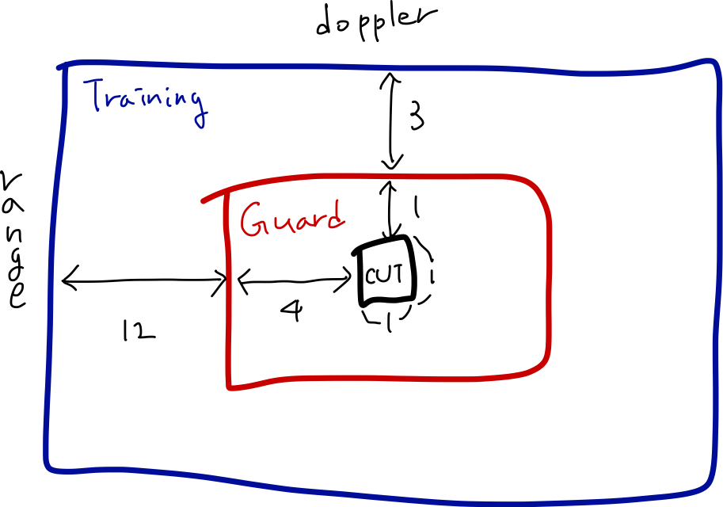
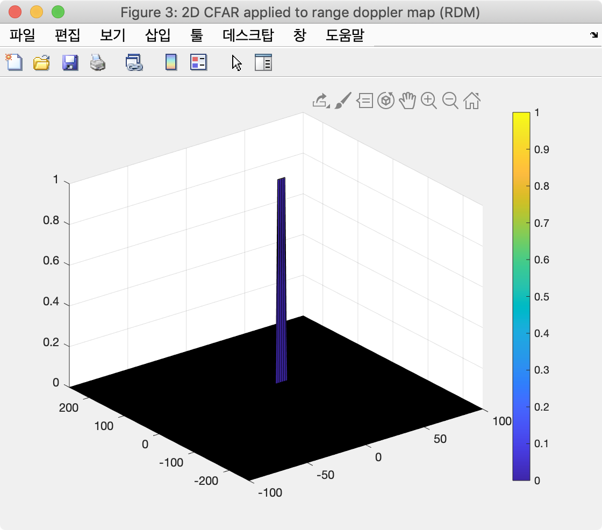

# Write up  
## Implementation steps for the 2D CFAR process.  
1. Select the number of training and guard cells. In this case, I am using the following values for the cells.  
Training cell for the range dimension (Tr) = 12  
Training cell for the doppler dimension (Td) = 3  
Guard cell for the range dimension (Gr) = 4  
Guard cell for the doppler dimension (Gd) = 1  

2.  Prepare the 2D zero matrix for having the CFAR values with the same size of the range-doppler map (RDM).  

3. Slide the CUT across the complete RDM by two loops, correspond to i and j coordinate.

4. Calculate the sum of the values within all training cells. To do this, compute the sum over the blue box (training, guard, and CUT) and subtract the sum over the red box (guard and CUT). In this case, db2pow function should be used.

5. Average the summed value above.
6. Calculate threshold with the offset.
7. Compare CUT signal against threshold, if CUT greater than threshold, assign it to 1.
8. Image below shows the output after CFAR.  

## Selection of Training, Guard cells and offset.  
Training cell for the range dimension (Tr) = 12  
Training cell for the doppler dimension (Td) = 3  
Guard cell for the range dimension (Gr) = 4  
Guard cell for the doppler dimension (Gd) = 1  
offset = 15

## Steps taken to suppress the non-thresholded cells at the edges.  

I added a zero padding to the surround of RDM by the padarray function. This makes the window to slide for all of the elements of RDM.
> RDM = padarray(RDM, [Tr+Td,Gr+Gd], 'both');